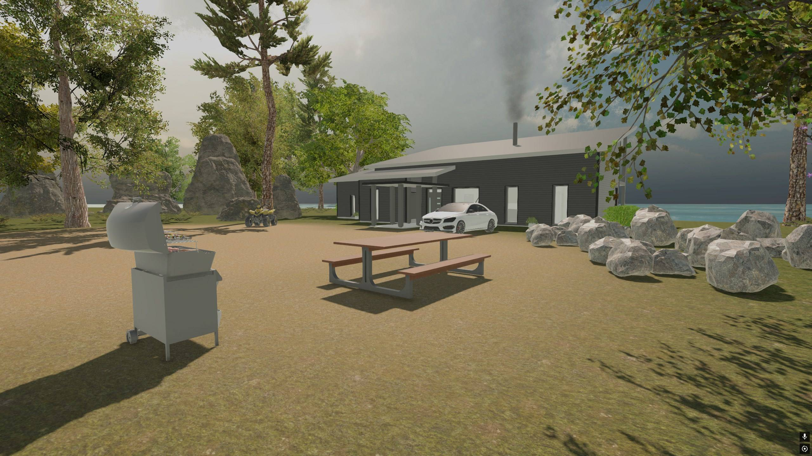
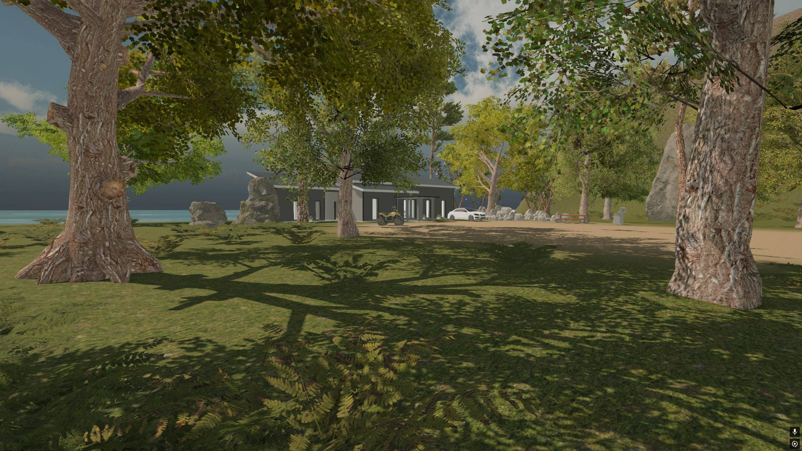
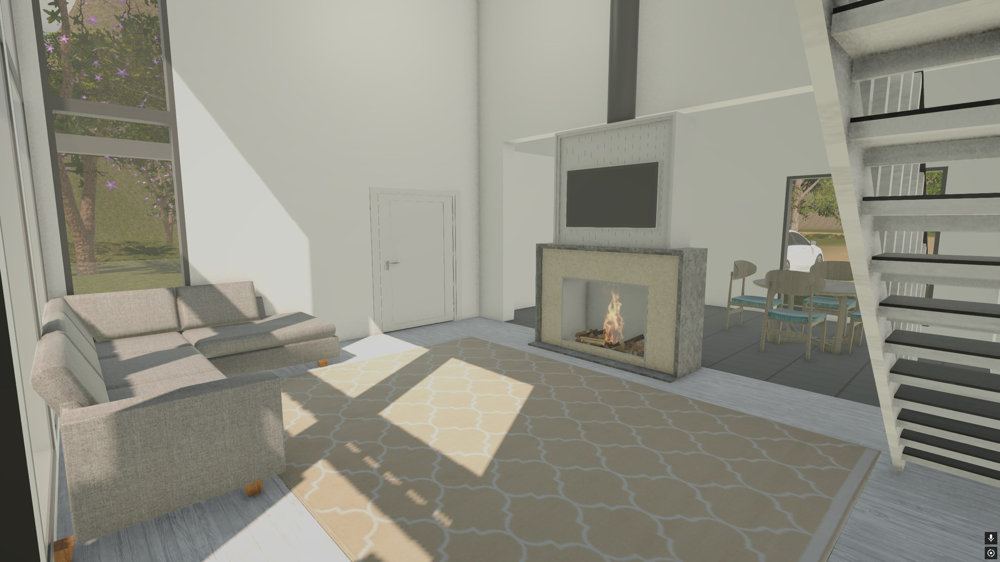
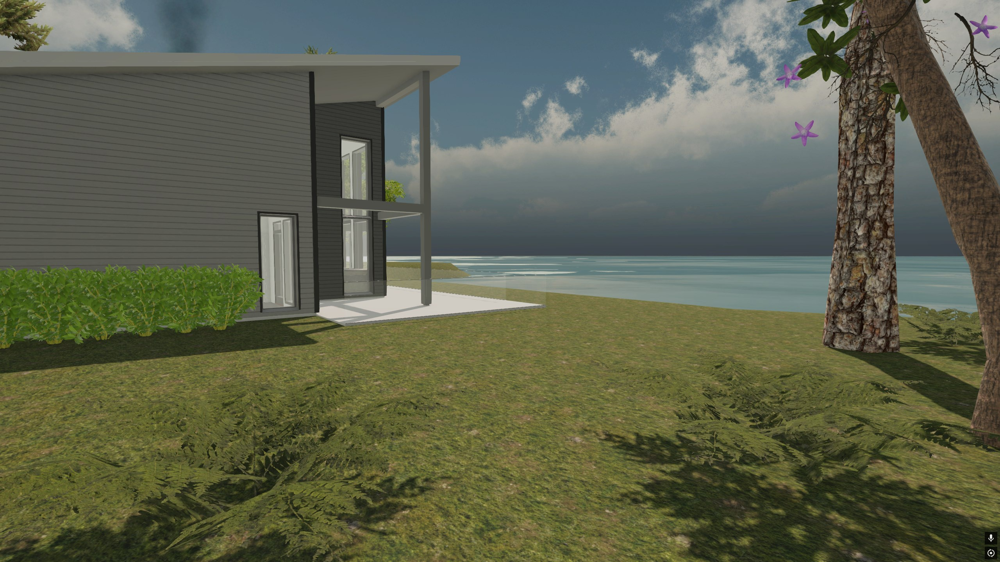
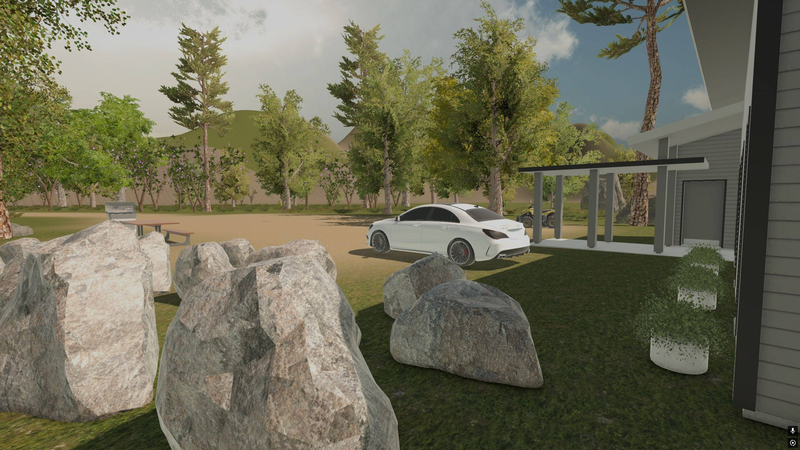
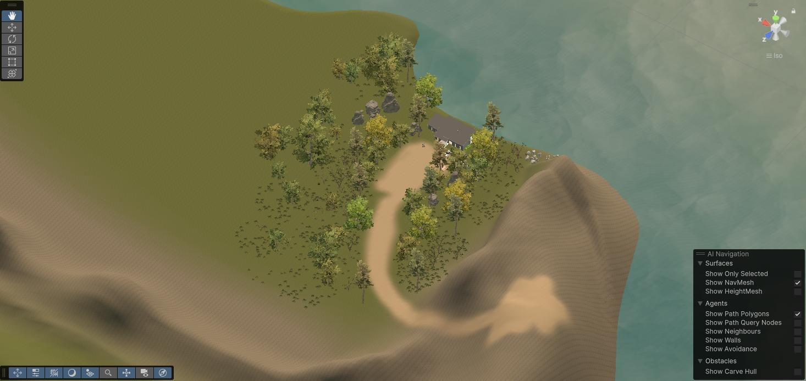

# Island Gamification

This project is part of a school assignment focused on **gamification**. The goal was to create an interactive island environment using Unity (editor version: 6000.0.43f1). The project features a variety of assets and environmental effects to enhance the user experience.

## Features:
- **First-Person Controller**: A character controller to move around and interact with the environment.
- **Interactive Doors**: Ability to open and close few doors to enter the house.
- **Particle Effects**: Fire in the fireplace/smoke coming out from top of the house.
- **Post-Processing Effects**: Visual enhancements for a more immersive experience.
- **Rotating Skybox**: A slowly rotating skybox to make it a bit more realistic.
- **Wind Zone**: Moving leaves and bushes powered by a wind zone.
- **Furniture and Decor**: Interior design elements like a couch, carpet, and chair to make the house feel realistic + all kind of assets outside bushes/cars etc.

## Screenshots

  

  

  

  

  

  

## 13.04.2025
- Added a creature to the scene and created 2 animations for it to walk and a "scare" animation that will later on trigger when player is nearby.

  
